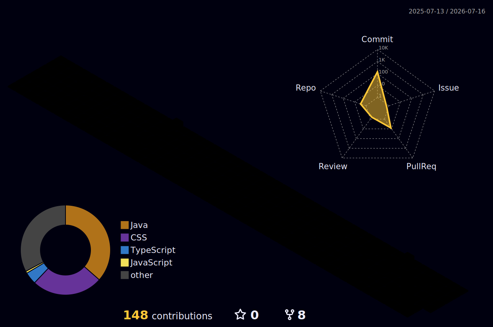

  

<h2 align="center">✨ Tech Stack ✨</h2>
  

    &nbsp
    &nbsp
    &nbsp
  

   

  

    &nbsp
    &nbsp
    &nbsp
  

   

<h2 align="center">📚 Studying 📚</h2>
  

    &nbsp
    &nbsp
    &nbsp
    &nbsp
  

   

  

    &nbsp
    &nbsp
    &nbsp   
  

   

<h2 align="center">📫 Contact 📫</h2>
  

    <a href="https://velog.io/@2seonga/posts">
      &nbsp
    </a>
    <a href="https://2seonga.github.io/">
      &nbsp;
    </a>
    <a href="mailto:2saritaum@gmail.com">
      &nbsp
    </a>
  

 
<h2 align="center">📊 GitHub Stats 📊</h2>

  

<!--  -->
